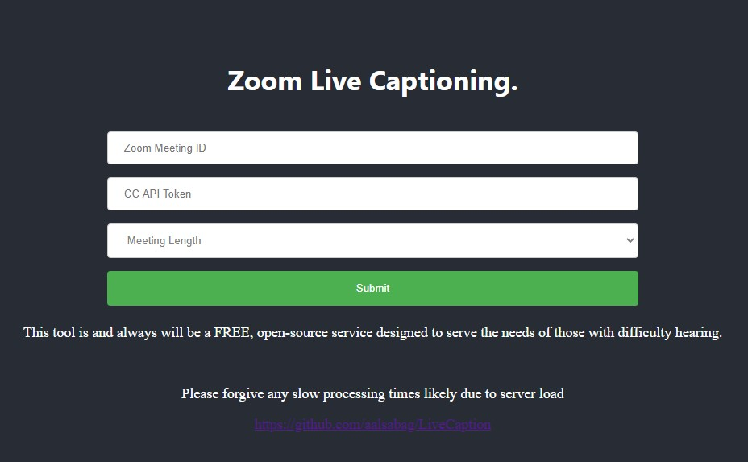

# LiveCaption
A live closed captioning tool for those who may have difficulty hearing.


## Steps for Usage:

1. Enter the Zoom Meeting ID found at the top right corner of your meeting. Do not include spaces.
2. Enter the Closed Captioning API token found by clicking "Closed Captioning" at the bottom of the meeting (this may be found under the "More" button) followed by "Copy the API token". Paste this as is
3. Designate a meeting length. Currently the app supports a maximum of two hours. If your meeting exceeds this, you may just repeat the process at conclusion.
4. You will be prompted with instructions on how to start streaming your meeting to the captioning service.
5. Enjoy!

## Implementation

The zoom call is streamed over a protocol called RTMP. A basic RTMP server is setup using
`ffmpeg`. Audio is extracted through `ALSA` and processed via the `vosk` api. Text is sent intermittently to Zoom. The RTMP module for nginx is used to manage multiple sessions at once. `ffmpeg` processes are multithreaded upon connectivity to te nginx service.

### FFMPEG

```
ffmpeg -re -f lavfi -i aevalsrc="sin(400*2*PI*t)" -ar 11025 -f alsa -f flv "rtmp://localhost:8084" #stream data

ffmpeg -f flv -listen 1 -i rtmp://localhost:8084 #receive data

```

In order to use `vosk` you will need to download a language model from the vosk website